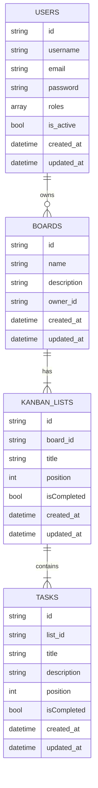

# Kanban API 🚀

A Symfony-based API for creating and managing a Kanban system. This API lets you manage boards, lists (columns), and tasks, and includes user authentication with JWT.

## Features ✨

- **User Management 👤**: Secure user registration, login, and profile management.
- **Kanban Boards 📋**: Create, view, update, and delete boards.
- **Dynamic Lists 📝**: Organize boards with customizable lists (columns).
- **Task Management ✅**: Add, update, move, and delete tasks across lists.
- **JWT Authentication 🔐**: Secure API endpoints with token-based authentication.
- **MySQL Database 💾**: Robust data storage with Doctrine ORM.

## Usage 🚀

1. **User Registration & Login**

   - **Register**: `POST /api/users/register`
   - **Login**: `POST /api/users/login` (Receive a JWT token)

2. **Manage Boards**

   - **Create Board**: `POST /api/boards`
   - **List Boards**: `GET /api/boards`
   - **Get Board Details**: `GET /api/boards/{id}`
   - **Update Board**: `PUT /api/boards/{id}`
   - **Delete Board**: `DELETE /api/boards/{id}`

3. **Manage Lists (Columns)**

   - **Create List**: `POST /api/lists`
   - **List Lists for a Board**: `GET /api/boards/{boardId}/lists`
   - **Update List**: `PUT /api/lists/{id}`
   - **Delete List**: `DELETE /api/lists/{id}`

4. **Manage Tasks**

   - **Create Task**: `POST /api/tasks`
   - **List Tasks for a List**: `GET /api/lists/{listId}/tasks`
   - **Move Task**: `PATCH /api/tasks/{id}/move`
   - **Update Task**: `PUT /api/tasks/{id}`
   - **Delete Task**: `DELETE /api/tasks/{id}`

## API Endpoints 🌐

### `Users` 👤

| Method | Endpoint            | Description              |
| ------ | ------------------- | ------------------------ |
| POST   | /api/users/register | Register a new user      |
| POST   | /api/users/login    | Login and obtain a JWT   |
| GET    | /api/users/me       | Get current user details |
| PUT    | /api/users/{id}     | Update user information  |
| DELETE | /api/users/{id}     | Delete a user            |

### `Boards` 📋

| Method | Endpoint         | Description        |
| ------ | ---------------- | ------------------ |
| GET    | /api/boards      | List all boards    |
| POST   | /api/boards      | Create a new board |
| GET    | /api/boards/{id} | Get board details  |
| PUT    | /api/boards/{id} | Update board       |
| DELETE | /api/boards/{id} | Delete board       |

### `Lists` 📝

| Method | Endpoint                    | Description                |
| ------ | --------------------------- | -------------------------- |
| POST   | /api/lists                  | Create a new list          |
| GET    | /api/boards/{boardId}/lists | List all lists for a board |
| PUT    | /api/lists/{id}             | Update a list              |
| DELETE | /api/lists/{id}             | Delete a list              |

### `Tasks` ✅

| Method | Endpoint                  | Description                     |
| ------ | ------------------------- | ------------------------------- |
| POST   | /api/tasks                | Create a new task               |
| GET    | /api/lists/{listId}/tasks | List tasks for a given list     |
| PATCH  | /api/tasks/{id}/move      | Move a task to a different list |
| PUT    | /api/tasks/{id}           | Update task details             |
| DELETE | /api/tasks/{id}           | Delete a task                   |

## Data Model 🗺

## Key Entities 🔑

- 👤 **Users**: Registered users for the Kanban system

  | Column     | Type     | Nullable | Description        |
  | ---------- | -------- | -------- | ------------------ |
  | id         | STRING   | NO       | Primary key        |
  | username   | STRING   | NO       | Unique username    |
  | email      | STRING   | NO       | User email         |
  | password   | STRING   | NO       | Encrypted password |
  | roles      | ARRAY    | NO       | User roles         |
  | isActive   | BOOLEAN  | NO       | User status        |
  | created_at | DATETIME | NO       | Creation date      |
  | updated_at | DATETIME | YES      | Last update date   |

  > _Note:_ For the `id` column, use this format: `USR-<timestamp>-<autogeneratednumber(4)>`

- 📋 **Boards**: Kanban boards for organizing lists and tasks

  | Column      | Type     | Nullable | Description           |
  | ----------- | -------- | -------- | --------------------- |
  | id          | STRING   | NO       | Primary key           |
  | name        | STRING   | NO       | Board name            |
  | description | TEXT     | YES      | Board description     |
  | owner_id    | STRING   | NO       | ID of the board owner |
  | created_at  | DATETIME | NO       | Creation date         |
  | updated_at  | DATETIME | YES      | Last update date      |

  > _Note:_ For the `id` column, use this format: `BRD-<timestamp>-<autogeneratednumber(4)>`

- 📝 **Kanban Lists**: Columns within a board

  | Column      | Type     | Nullable | Description                 |
  | ----------- | -------- | -------- | --------------------------- |
  | id          | STRING   | NO       | Primary key                 |
  | board_id    | STRING   | NO       | Associated board ID         |
  | title       | STRING   | NO       | List title                  |
  | position    | INT      | NO       | Order position in the board |
  | isCompleted | BOOLEAN  | NO       | List completion status      |
  | created_at  | DATETIME | NO       | Creation date               |
  | updated_at  | DATETIME | YES      | Last update date            |

  > _Note:_ For the `id` column, use this format: `LST-<timestamp>-<autogeneratednumber(4)>`

- ✅ **Tasks**: Tasks that are assigned to lists

  | Column      | Type     | Nullable | Description                    |
  | ----------- | -------- | -------- | ------------------------------ |
  | id          | STRING   | NO       | Primary key                    |
  | list_id     | STRING   | NO       | Associated list ID             |
  | title       | STRING   | NO       | Task title                     |
  | description | TEXT     | YES      | Task details                   |
  | position    | INT      | NO       | Order position within the list |
  | isCompleted | BOOLEAN  | NO       | Task completion status         |
  | created_at  | DATETIME | NO       | Creation date                  |
  | updated_at  | DATETIME | YES      | Last update date               |

  > _Note:_ For the `id` column, use this format: `TSK-<timestamp>-<autogeneratednumber(4)>`
